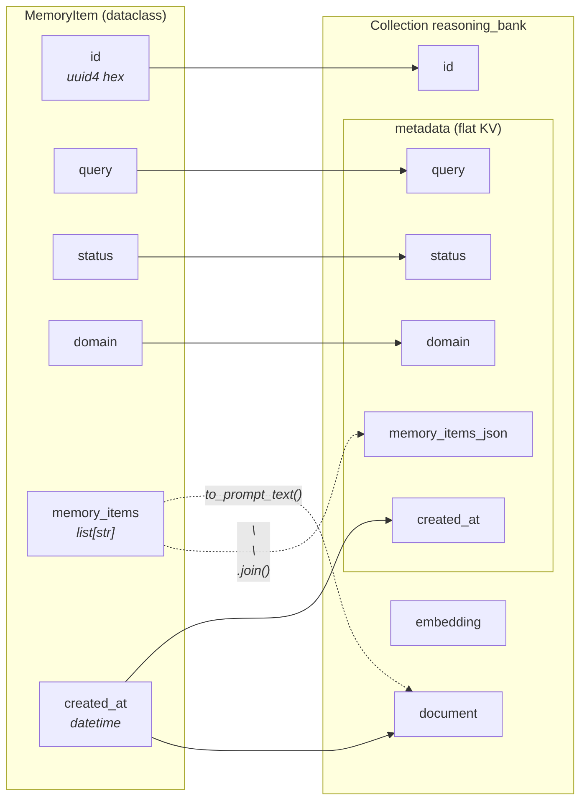
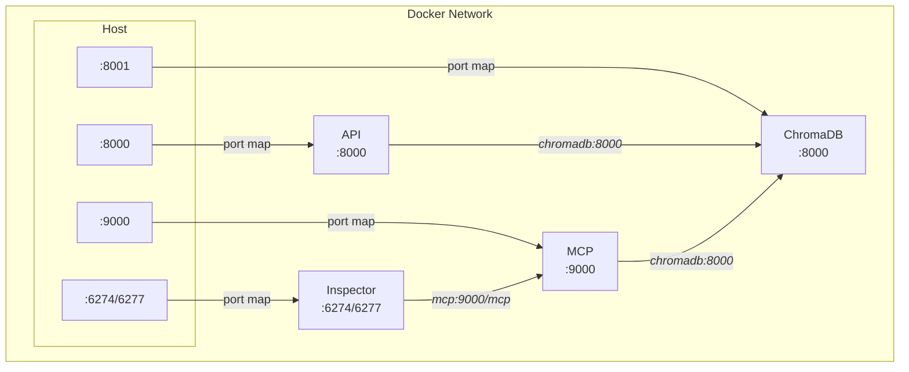

<div align="center">

# ReasoningBank SDK

[](https://github.com/Gzmomo001/reasoning-bank-sdk/actions/workflows/docker-publish.yml)
[](https://gzmomo001.github.io/reasoning-bank-sdk/presentation.html)
[](https://gzmomo001.github.io/reasoning-bank-sdk/presentation.html)
[](https://github.com/Gzmomo001/reasoning-bank-sdk/blob/main/docs/report.md)
[](https://www.python.org/downloads/)
[](https://opensource.org/licenses/MIT)

</div>

Persistent agent memory with induction, retrieval, and scaling. ReasoningBank lets AI agents learn from their trajectories — extracting, storing, and retrieving generalizable memory items across tasks.

## Features

- **Memory Induction** — Extract actionable insights from single or multiple agent trajectories using LLM
- **Semantic Retrieval** — Retrieve relevant memories via embedding-based similarity search
- **Scaling Induction** — Compare multiple trajectories (success vs. failure) to distill contrastive insights
- **Multiple Storage Backends** — ChromaDB (vector search) or JSONL (lightweight file-based)
- **Multiple LLM Providers** — OpenAI, Google Gemini, Anthropic, or custom clients
- **Multiple Embedding Providers** — OpenAI, Gemini, or custom embedding functions
- **REST API** — FastAPI server with full CRUD + induction endpoints
- **MCP Server** — Model Context Protocol server for integration with MCP-compatible clients

## Installation

```bash
uv sync
git config core.hooksPath .githooks

# config .env
# if you want to deploy with Docker, copy .env.example to the docker folder.
cp .env.example .env
```

Requires Python >= 3.12.

## Quick Start

### Python SDK

```python
import asyncio
from reasoning_bank import MemoryBank
from reasoning_bank.llm.openai_client import OpenAIClient

async def main():
    bank = await MemoryBank.create(
        storage="chroma",
        storage_path="./memories",
        embedding_provider="gemini",
        embedding_model="gemini-embedding-001",
        llm_client=OpenAIClient(api_key="sk-..."),
    )

    # Retrieve relevant memories
    memories = await bank.retrieve(query="how to fix login bug", top_k=3)

    # Induce memories from a successful trajectory
    items = await bank.induce(
        query="Navigate to shopping cart",
        trajectory="...",
        status="success",
        domain="web",
    )

    # Induce memories by comparing multiple trajectories
    items = await bank.induce_scaling(
        query="Add item to wishlist",
        trajectories=[
            {"trajectory": "...", "status": "success"},
            {"trajectory": "...", "status": "fail"},
        ],
        domain="web",
    )

    # Directly add a memory item (no LLM needed)
    item = await bank.add(
        query="Search for products",
        memory_items=["Always use the search bar in the top navigation..."],
        status="success",
        domain="web",
    )

    # List, count, or delete
    all_memories = await bank.list()
    total = await bank.count()
    await bank.delete(item_id=item.id)

asyncio.run(main())
```

### REST API

```bash
# Start the server
uv run uvicorn reasoning_bank_api.app:app --host 0.0.0.0 --port 8000
```

#### `POST /v1/memory/items`

Add a memory item directly (no LLM needed).

```json
// Request
{
  "query": "Search for products",
  "memory_items": ["Always use the search bar in the top navigation"],
  "status": "success",
  "domain": "general"
}

// Response — 201 Created
{
  "data": {
    "id": "d4e5f6...",
    "query": "Search for products",
    "status": "success",
    "domain": "general",
    "memory_items": ["Always use the search bar in the top navigation"],
    "created_at": "2025-01-01T00:00:00+00:00"
  },
  "meta": {}
}
```

#### `GET /v1/memory/items`

List all stored memories.

```json
// Response
{
  "data": [
    {
      "id": "...",
      "query": "...",
      "status": "success",
      "domain": "web",
      "memory_items": ["..."],
      "created_at": "..."
    }
  ],
  "meta": { "total": 42 }
}
```

#### `GET /v1/memory/items/count`

Get the total number of stored memories.

```json
// Response
{
  "data": { "count": 42 },
  "meta": {}
}
```

#### `GET|POST /v1/memory/items/search`

Retrieve relevant memories via semantic similarity search.

GET with query parameters:

```
GET /v1/memory/items/search?query=how+to+fix+login+bug&top_k=3
```

POST with JSON body:

```json
// Request
{
  "query": "how to fix login bug",
  "top_k": 3
}

// Response
{
  "data": [
    {
      "id": "a1b2c3...",
      "query": "fix login issue",
      "status": "success",
      "domain": "web",
      "memory_items": ["Check the session cookie expiration..."],
      "created_at": "2025-01-01T00:00:00+00:00"
    }
  ],
  "meta": { "total": 1 }
}
```

#### `DELETE /v1/memory/items/{item_id}`

Delete a memory item by its ID.

```json
// Response
{
  "data": { "deleted": true, "id": "a1b2c3..." },
  "meta": {}
}
```

#### `POST /v1/memory/inductions`

Run full auto induction — extract memory items from a single trajectory using LLM.

```json
// Request
{
  "query": "Navigate to shopping cart",
  "trajectory": "Step 1: Clicked on 'Cart' icon...",
  "status": "success",
  "domain": "web"
}

// Response — 201 Created
{
  "data": [
    {
      "id": "...",
      "query": "Navigate to shopping cart",
      "status": "success",
      "domain": "web",
      "memory_items": ["The cart icon is located in the top-right corner..."],
      "created_at": "..."
    }
  ],
  "meta": { "total": 1 }
}
```

#### `POST /v1/memory/inductions/batch`

Run multi-trajectory contrast induction — compare trajectories and extract contrastive insights.

```json
// Request
{
  "query": "Add item to wishlist",
  "trajectories": [
    { "trajectory": "Clicked wishlist button...", "status": "success" },
    { "trajectory": "Clicked add-to-cart instead...", "status": "fail" }
  ],
  "domain": "web"
}

// Response — 201 Created
{
  "data": [
    {
      "id": "...",
      "query": "Add item to wishlist",
      "status": "success",
      "domain": "web",
      "memory_items": ["The wishlist button is a heart icon, not the cart button..."],
      "created_at": "..."
    }
  ],
  "meta": { "total": 1 }
}
```

### MCP Server

```bash
uv run reasoning-bank-mcp --transport streamable-http --port 9000
```

#### MCP Tools

| Tool | Description |
|------|-------------|
| `reasoning_bank_retrieve` | Retrieve relevant memories via semantic similarity |
| `reasoning_bank_add` | Add a memory item directly (no LLM) |
| `reasoning_bank_induce` | Extract memory items from a single trajectory using LLM |
| `reasoning_bank_induce_scaling` | Compare multiple trajectories and extract contrastive insights |
| `reasoning_bank_list` | List all stored memories |
| `reasoning_bank_delete` | Delete a memory item by its ID |
| `reasoning_bank_count` | Get total memory count |

#### MCP Resource

| URI | Description |
|-----|-------------|
| `reasoning-bank://stats` | Returns `{"count": N}` |

#### Tool Parameters

**`reasoning_bank_retrieve`**
```
query: string    — Search query
top_k: int       — Number of results (default: 3)
```

**`reasoning_bank_add`**
```
query: string          — Task description
memory_items: string[] — Memory texts to store
status: string         — "success" | "fail" (default: "success")
domain: string         — "web" | "coding" | "general" (default: "general")
```

**`reasoning_bank_induce`**
```
query: string       — Task description
trajectory: string  — Full agent trajectory text
status: string      — "success" | "fail"
domain: string      — "web" | "coding" | "general" (default: "web")
```

**`reasoning_bank_induce_scaling`**
```
query: string                         — Task description
trajectories: {trajectory, status}[]  — Multiple trajectory entries
domain: string                        — "web" | "coding" | "general" (default: "web")
```

**`reasoning_bank_delete`**
```
item_id: string — Memory item ID to delete
```

#### Configure MCP for Claude Code

Add to your project's `.mcp.json` or global `~/.claude/mcp.json`:

**Streamable HTTP transport (connect to Docker or remote server):**
```json
{
  "mcpServers": {
    "reasoning-bank": {
      "type": "streamable-http",
      "url": "http://localhost:9000/mcp"
    }
  }
}
```

**Stdio transport (local process):**
```json
{
  "mcpServers": {
    "reasoning-bank": {
      "type": "stdio",
      "command": "uv",
      "args": ["run", "reasoning-bank-mcp"],
      "env": {
        "LLM_PROVIDER": "openai",
        "LLM_MODEL": "gpt-4o",
        "LLM_API_KEY": "sk-...",
        "EMBEDDING_PROVIDER": "gemini",
        "EMBEDDING_MODEL": "gemini-embedding-001",
        "STORAGE": "chroma",
        "STORAGE_PATH": "./memories"
      }
    }
  }
}
```

#### Configure MCP for OpenCode

Add to your project's `.opencode.json` or global `~/.config/opencode/opencode.json`:

**Streamable HTTP transport:**
```json
{
  "mcp": {
    "reasoning-bank": {
      "type": "streamable-http",
      "url": "http://localhost:9000/mcp"
    }
  }
}
```

**Stdio transport:**
```json
{
  "mcp": {
    "reasoning-bank": {
      "type": "stdio",
      "command": "uv",
      "args": ["run", "reasoning-bank-mcp"],
      "env": {
        "LLM_PROVIDER": "openai",
        "LLM_MODEL": "gpt-4o",
        "LLM_API_KEY": "sk-...",
        "EMBEDDING_PROVIDER": "gemini",
        "EMBEDDING_MODEL": "gemini-embedding-001",
        "STORAGE": "chroma",
        "STORAGE_PATH": "./memories"
      }
    }
  }
}
```

## Docker

```bash
# Copy .env and fill in API keys
cp .env.example .env

# Start all services (ChromaDB + API + MCP + Inspector)
cd docker && docker compose up
```

- **ChromaDB**: `http://localhost:8001`
- **API**: `http://localhost:8000`
- **MCP (Streamable HTTP)**: `http://localhost:9000`
- **MCP Inspector**: `http://localhost:6274`

### MCP Inspector

A web UI for interactively testing MCP tools and resources.

> **Warning:** Inspector runs with `DANGEROUSLY_OMIT_AUTH=true` — no authentication. Only use in local development. Do not expose port 6274/6277 to the public internet.

**Docker (recommended):** `docker compose up` and open `http://localhost:6274`. Select Streamable HTTP transport, enter `http://mcp:9000/mcp`, and click Connect.

**Local:**

```bash
# Start MCP server first
uv run reasoning-bank-mcp --transport streamable-http --port 9000

# Then launch inspector
pnpm dlx @modelcontextprotocol/inspector
# or
bash scripts/inspector.sh
```

## Configuration

Configuration is via environment variables. Copy `.env.example` to `.env` and fill in the values:

```bash
cp .env.example .env
```

### LLM

| Variable | Default | Description |
|----------|---------|-------------|
| `LLM_API_KEY` | *(empty)* | **Required.** API key for LLM provider (needed for induction / scaling) |
| `LLM_PROVIDER` | `openai` | LLM provider (`openai`, `anthropic`, `vertexai`, `google_ai`) |
| `LLM_MODEL` | *(empty)* | LLM model name (e.g. `gpt-4o`, `gemini-2.0-flash`) |
| `LLM_API_BASE_URL` | *(empty)* | Custom base URL for OpenAI-compatible APIs |
| `LLM_RPM` | `0` | Max LLM requests per minute (0 = unlimited) |

### Embedding

| Variable | Default | Description |
|----------|---------|-------------|
| `EMBEDDING_PROVIDER` | `gemini` | Embedding provider (`gemini` or `openai`) |
| `EMBEDDING_MODEL` | *(provider default)* | Embedding model name (e.g. `gemini-embedding-001`) |
| `EMBEDDING_API_KEY` | *(falls back to `LLM_API_KEY`)* | Embedding API key. Required for Gemini with Google AI Studio; not needed for Vertex AI (uses ADC) |
| `EMBEDDING_RPM` | `0` | Max embedding requests per minute (0 = unlimited) |

### Storage

| Variable | Default | Description |
|----------|---------|-------------|
| `STORAGE` | `chroma` | Storage backend (`chroma` or `jsonl`) |
| `STORAGE_PATH` | `./memories` | Storage directory path |
| `CHROMA_HOST` | *(empty)* | ChromaDB host (leave empty for **embedded mode**) |
| `CHROMA_PORT` | *(empty)* | ChromaDB port (only needed when `CHROMA_HOST` is set) |

> **Note:** When `CHROMA_HOST` and `CHROMA_PORT` are not set, ChromaDB runs in **embedded mode** using `PersistentClient` — no separate database server is needed. Data is stored locally in the `STORAGE_PATH` directory. Only set these variables when connecting to a standalone ChromaDB server (e.g. in Docker deployments).

### Google Gemini / Vertex AI

| Variable | Default | Description |
|----------|---------|-------------|
| `GOOGLE_GENAI_USE_VERTEXAI` | `False` | Set to `True` if using Vertex AI instead of Google AI Studio |

### Logging

| Variable | Default | Description |
|----------|---------|-------------|
| `LOG_LEVEL` | `INFO` | Logging level (`DEBUG`, `INFO`, `WARNING`, `ERROR`) |
| `LOG_DIR` | *(empty)* | Directory for log files (used by API and MCP services) |

## ChromaDB Storage Schema

The project uses a single ChromaDB collection named `reasoning_bank` with HNSW index (cosine distance). Each record maps from `MemoryItem` to ChromaDB as follows:



### Docker Network



## Architecture

```
reasoning_bank/
  core/
    bank.py          # MemoryBank — main entry point
    memory_item.py   # MemoryItem data model
    induction.py     # Single-trajectory induction
    scaling.py       # Multi-trajectory scaling induction
    embedding.py     # Embedding providers (Gemini, OpenAI, Custom)
    parsing.py       # LLM output parsing (strip thinking chains, split items)
    rate_limiter.py  # Token-bucket rate limiter for API calls
    prompts.py       # Domain-adapted prompt templates
  llm/
    base.py          # LLMClient abstract base
    openai_client.py # OpenAI LLM client
    gemini_client.py # Google Gemini LLM client
    anthropic_client.py # Anthropic LLM client
  storage/
    base.py          # StorageBackend abstract base
    chroma.py        # ChromaDB storage backend
    jsonl.py         # JSONL file-based storage backend
  logging_config.py  # Shared logging configuration for services
reasoning_bank_api/
  app.py             # FastAPI application factory
  routes.py          # HTTP route handlers
reasoning_bank_mcp/
  server.py          # MCP server (tools + resources)
```

## Domains

Induction prompts are domain-adapted for:

- **`web`** — Web navigation tasks
- **`coding`** — Code repository tasks
- **`general`** — General interactive environments

## [Presentation](https://gzmomo001.github.io/reasoning-bank-sdk/presentation.html) | [Report](./docs/report.md)

## Testing

```bash
uv run pytest
```

## License

MIT
