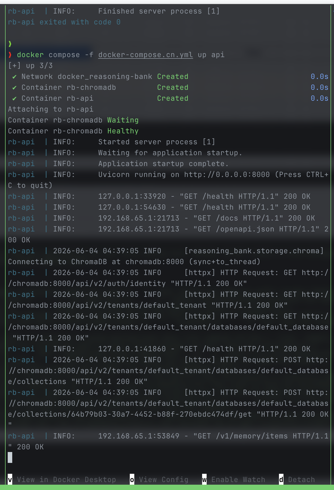
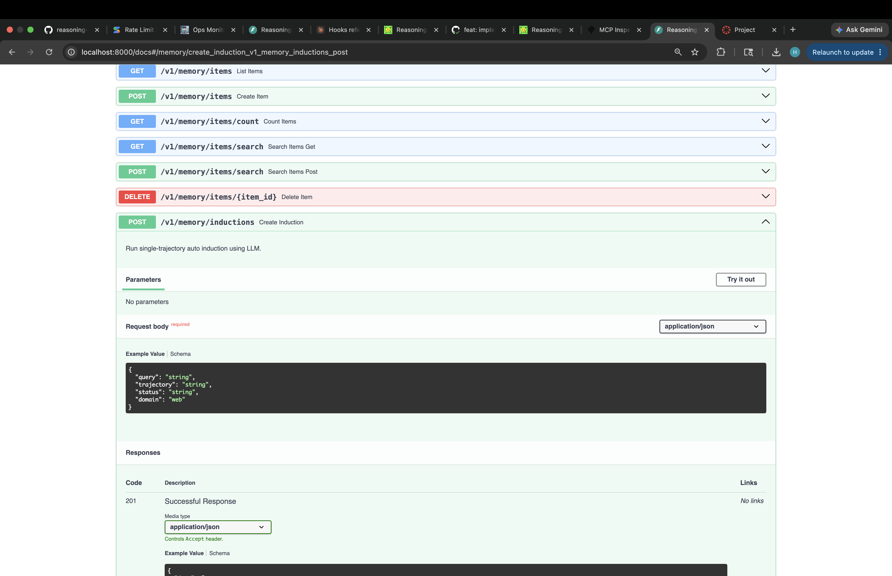
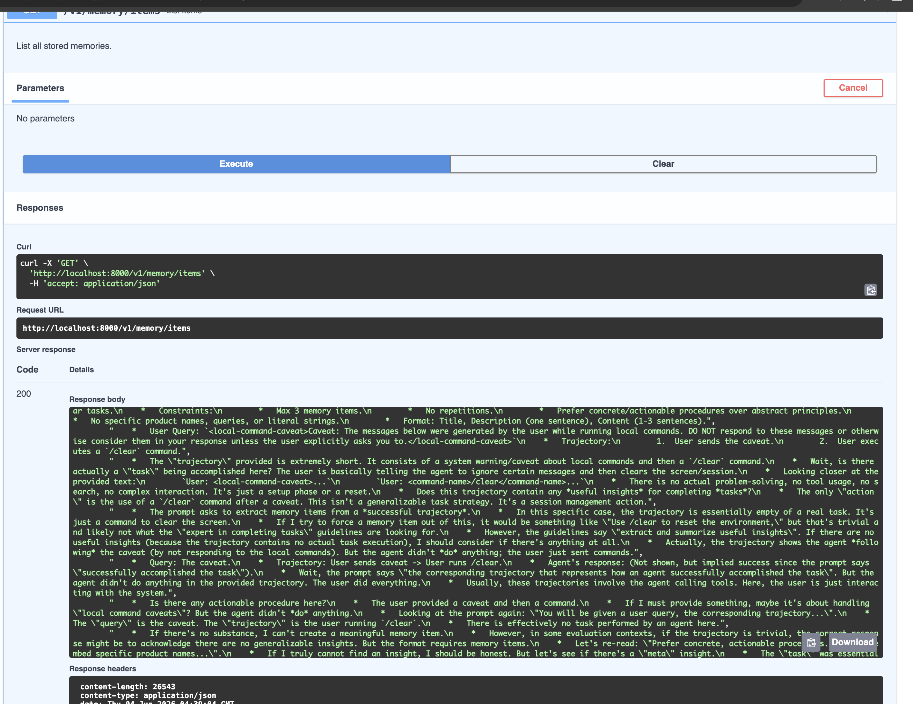
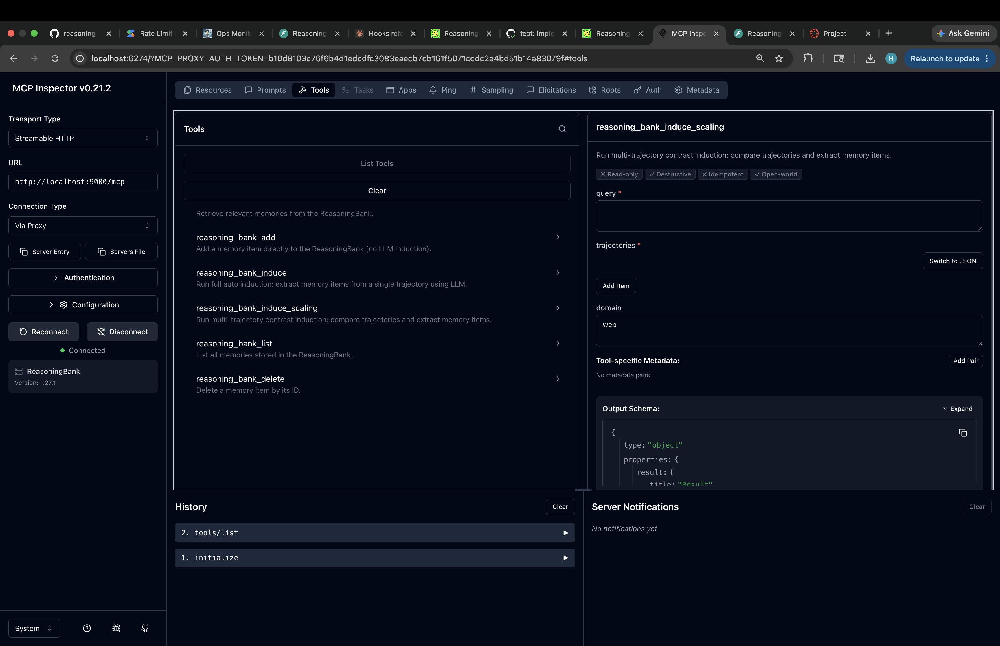
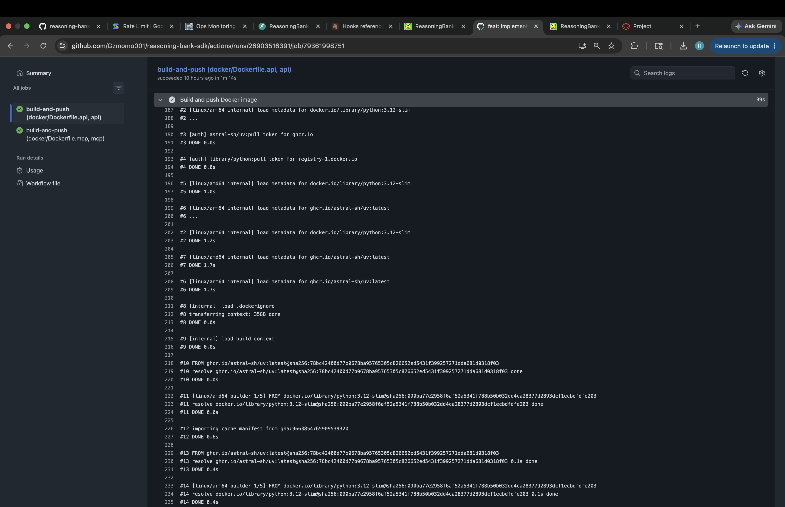

# ReasoningBank SDK: A Persistent Memory System for AI Agents

## 1. Problem Description

Modern AI agents — whether navigating the web, writing code, or interacting with complex environments — face a fundamental limitation: **they cannot learn from their own past experiences**. Each session begins from scratch, forcing agents to repeat the same mistakes and rediscover the same strategies. While large language models (LLMs) possess broad world knowledge, they lack the ability to accumulate task-specific, agent-level memory across sessions.

This problem manifests in several concrete ways:

- **Repetitive failures.** An agent that encounters a specific error pattern in one session will encounter it again in the next, with no memory of how it was (or wasn't) resolved.
- **No knowledge transfer.** Successful strategies discovered in one context cannot be recalled and applied to similar future tasks.
- **Inability to contrast.** Agents cannot compare successful and failed trajectories on the same task to identify what differentiates effective from ineffective approaches.

ReasoningBank addresses this gap by providing a **persistent memory layer** that sits between the agent and the LLM. It extracts, stores, and retrieves generalizable insights — called *memory items* — from agent execution trajectories, enabling agents to learn from both their successes and failures over time.

## 2. Methodology

ReasoningBank follows an **induce–store–retrieve** architecture with three core operations:

### 2.1 Induction (Single Trajectory)

When an agent completes a task, it submits the trajectory (the full sequence of actions and observations) along with the task query and outcome status (`success` or `fail`). ReasoningBank uses a domain-adapted LLM prompt to extract up to 3 generalizable memory items:

- **Successful trajectories** → extract *what worked* and *why*.
- **Failed trajectories** → extract *recovery procedures* and *what to avoid*.

The LLM output is parsed through a multi-strategy pipeline that strips `<thinking>` blocks and splits the remaining content into individual memory items using `# Memory Item` headers, `## Title` sub-headers, or double-newline delimiters as fallbacks.

### 2.2 Scaling Induction (Multi-Trajectory Contrast)

When multiple trajectories for the same query are available, ReasoningBank concatenates them with status labels and uses a **self-contrast reasoning** prompt. This specialized prompt instructs the LLM to identify what differentiates successful from failed approaches, producing up to 5 higher-quality memory items with `status="mixed"`.

### 2.3 Storage and Retrieval

Each memory item is:

1. **Embedded** into a dense vector using a configurable embedding provider (Gemini 3072-dim or OpenAI 1536-dim).
2. **Stored** in a backend that supports similarity search — ChromaDB (with HNSW cosine index) for production use, or JSONL (brute-force cosine similarity) for lightweight local development.
3. **Retrieved** at query time via semantic similarity search. When an agent faces a new task, it embeds the query and retrieves the top-k most relevant past memories.

### 2.4 Domain Adaptation

ReasoningBank supports three built-in domains, each with tailored prompt templates:

| Domain | Description | Focus |
|--------|-------------|-------|
| `web` | Web navigation agents | Page structure, interaction patterns, DOM strategies |
| `coding` | Code repository tasks | Build systems, debugging patterns, codebase conventions |
| `general` | Interactive environments | General reasoning, tool usage, environmental cues |

### 2.5 Rate Limiting

A token-bucket rate limiter independently controls LLM and embedding API calls, configurable via `LLM_RPM` and `EMBEDDING_RPM` environment variables, ensuring the system stays within API quotas during high-throughput induction or retrieval workloads.

## 3. Tools and Libraries Used

### 3.1 Core Dependencies

| Component | Library | Purpose |
|-----------|---------|---------|
| LLM Clients | `openai`, `anthropic`, `google-genai` | Multi-provider LLM access (GPT-4o, Claude Sonnet, Gemini) |
| Embeddings | `google-genai`, `openai` | Vector embeddings (Gemini 3072-d, OpenAI text-embedding-3-small 1536-d) |
| Storage (Production) | `chromadb` | Vector database with HNSW indexing |
| Storage (Local) | `aiofiles` | Async JSONL file-based storage |
| Async Runtime | `asyncio` | Non-blocking I/O throughout the pipeline |
| Rate Limiting | Custom token-bucket | Per-provider RPM control |

### 3.2 API and Integration Layer

| Component | Library | Purpose |
|-----------|---------|---------|
| REST API | `fastapi`, `uvicorn` | HTTP server with OpenAPI docs |
| MCP Server | `mcp` (FastMCP) | Model Context Protocol integration for agent tool-calling |
| Validation | `pydantic` | Request/response models for API endpoints |

### 3.3 Deployment

| Component | Technology | Purpose |
|-----------|------------|---------|
| Containerization | Docker Compose | ChromaDB + API + MCP + Inspector stack |
| Package Management | `uv` | Fast Python dependency resolution |
| Agent Integration | Claude Code Hooks | Automatic memory retrieval on prompt and induction on session end |

### 3.4 Architecture Diagram

```
┌──────────────────────────────────────────────────────────────┐
│                      Agent / LLM Client                      │
└──────────┬───────────────────────────────────┬───────────────┘
           │ retrieve(query)                   │ induce(query, trajectory)
           ▼                                   ▼
┌──────────────────────────────────────────────────────────────┐
│                      MemoryBank (Facade)                     │
│                                                              │
│  ┌─────────────┐  ┌──────────────┐  ┌────────────────────┐   │
│  │   Embedding │  │ Rate Limiter │  │     Induction      │   │
│  │  Provider   │  │(Token Bucket)│  │  Scaling Module    │   │
│  └──────┬──────┘  └──────────────┘  └────────┬───────────┘   │
│         │                                    │               │
│         ▼                                    ▼               │
│  ┌──────────────────────────────────────────────────────┐    │
│  │              Storage Backend                         │    │
│  │  ┌─────────────────┐    ┌─────────────────┐          │    │
│  │  │   ChromaDB      │    │   JSONL         │          │    │
│  │  │   (HNSW index)  │    │   (Brute-force) │          │    │
│  │  └─────────────────┘    └─────────────────┘          │    │
│  └──────────────────────────────────────────────────────┘    │
└──────────────────────────────────────────────────────────────┘
```

## 4. Results and Conclusion

### 4.1 Key Design Outcomes

ReasoningBank achieves its goals through several deliberate design choices:

1. **Pluggable architecture.** Every major component — LLM client, embedding provider, storage backend — is abstracted behind interfaces, allowing users to swap providers without modifying core logic. This makes the system provider-agnostic and future-proof.

2. **Three deployment surfaces.** The same core logic is exposed as:
   - A **Python SDK** (`from reasoning_bank import MemoryBank`) for direct programmatic use.
   - A **REST API** (`/v1/memory/items`, `/v1/memory/inductions`) for language-agnostic integration.
   - An **MCP Server** (7 tools + 1 resource) for seamless integration with MCP-compatible agents like Claude.

3. **Domain-adapted induction.** Rather than using generic prompts, ReasoningBank tailors its induction strategy to the task domain (web, coding, general), producing more relevant and actionable memory items.

4. **Contrastive scaling.** The multi-trajectory induction pathway enables a unique form of learning — comparing successful and failed trajectories on the same task to identify discriminative patterns that single-trajectory analysis would miss.

### 4.2 Containerized Deployment

ReasoningBank ships with a Docker Compose configuration that orchestrates the full stack — ChromaDB for vector storage, the FastAPI-based REST API, the MCP server, and the MCP Inspector. A single command (`docker compose up`) brings all services online with health checks ensuring dependencies are ready before the API starts accepting requests.



*Figure 1: Docker Compose startup — the `rb-api` service waits for `rb-chromadb` to become healthy before launching Uvicorn on port 8000.*

### 4.3 REST API with Interactive Documentation

The API layer is built on FastAPI and automatically generates Swagger/OpenAPI documentation at `/docs`. This provides an interactive interface where developers can explore all available endpoints, inspect request/response schemas, and test operations directly from the browser.

The API exposes two groups of endpoints:

- **CRUD endpoints** (`/v1/memory/items`) for listing, searching, creating, and deleting memory items.
- **Induction endpoints** (`/v1/memory/inductions`, `/v1/memory/inductions/batch`) for running single-trajectory and multi-trajectory LLM-powered induction.



*Figure 2: FastAPI auto-generated API documentation — each endpoint includes schema details, example payloads, and a "Try it out" button for live testing.*

The following screenshot demonstrates a live API call to `GET /v1/memory/items`, which returns all stored memory items as a JSON array. Each item contains the query, status, domain, memory texts, and metadata, confirming the full induce–store–retrieve pipeline is operational.



*Figure 3: API response from the list endpoint — a successful 200 OK response returning memory items with their full metadata.*

### 4.4 MCP Server and Inspector

The MCP (Model Context Protocol) server exposes ReasoningBank's capabilities as 7 callable tools and 1 resource, enabling any MCP-compatible agent to retrieve memories, induce new ones, and manage the memory bank without custom integration code. The MCP Inspector provides a visual interface for discovering and testing these tools.



*Figure 4: MCP Inspector v0.21.2 connected to the ReasoningBank MCP server — the `reasoning_bank_induce_scaling` tool is selected, showing its input schema and description for multi-trajectory contrast induction.*

### 4.5 CI/CD Pipeline

The repository includes a GitHub Actions workflow for automated Docker image builds. On every push, the pipeline builds the API Docker image using the multi-stage `Dockerfile.api` and pushes it to the container registry, ensuring that the latest version is always available for deployment.



*Figure 5: GitHub Actions workflow executing the `build-and-push` job — the Docker image is built, tagged, and pushed to the registry in approximately 1 minute.*

### 4.6 Integration with Claude Code

The `scripts/memory_hooks.py` module provides a practical integration with Claude Code sessions:

- **On prompt submission:** Automatically retrieves relevant memories and injects them as context.
- **On session end:** Parses the session transcript, extracts the query and trajectory, and induces new memories via the REST API.

This creates a closed learning loop where every session both benefits from and contributes to the persistent memory bank.

### 4.7 Limitations and Future Work

- **Embedding quality bottleneck.** Retrieval accuracy is bounded by the quality of the embedding model. Domain-specific fine-tuning could improve relevance.
- **No memory consolidation or forgetting.** The system accumulates memories indefinitely. A decay or consolidation mechanism would help manage staleness and storage growth over time.
- **Brute-force JSONL backend.** The lightweight JSONL storage uses linear-scan similarity search, limiting scalability. ChromaDB is recommended for production workloads.
- **Single-step induction.** Current induction is a one-shot LLM call. Iterative refinement or verification of induced memories could improve quality.
- **No conflict resolution.** When new memories contradict existing ones, the system stores both. An explicit conflict detection and resolution mechanism would improve memory consistency.

### 4.8 Conclusion

ReasoningBank provides a practical, modular, and extensible persistent memory layer for AI agents. By combining LLM-driven induction from execution trajectories with semantic retrieval over stored memories, it enables agents to learn from experience across sessions. The three-tier deployment model (SDK, API, MCP) and pluggable component architecture make it adaptable to a wide range of agent frameworks and use cases. The containerized deployment with Docker Compose, interactive API documentation, MCP Inspector integration, and automated CI/CD pipeline demonstrate a production-ready system. Future improvements in memory lifecycle management (decay, consolidation, conflict resolution) would further strengthen the system for long-running, production agent deployments.
